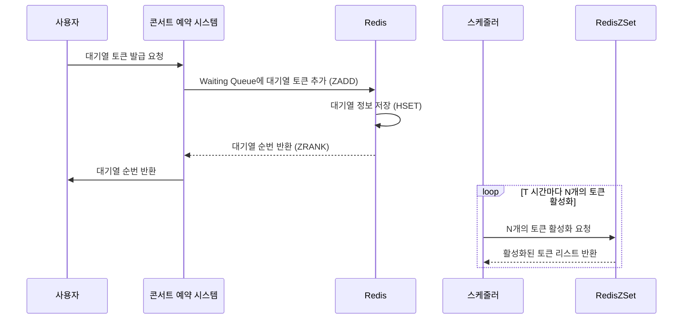

# 캐시와 Redis를 이용한 성능 개선

## 개요

콘서트 예약 프로젝트에서 API 응답 속도를 높이고 서버 부하를 줄이기 위해 캐시를 적용했습니다. 이번 작업을 위해 먼저 캐시의 기본 개념과 다양한 캐싱 전략을 학습했고, 관련
내용을 [캐시(Cache)와 캐싱 전략(Caching Strategy)](https://penguin-dev.tistory.com/24)에 정리했습니다.

## 콘서트 예약 프로젝트에서의 캐싱 적용

콘서트 예약 프로젝트에서 캐싱을 통해 성능을 개선할 수 있는 부분들을 검토했습니다. 여기서 목표는 대규모 트래픽이 몰렸을 때 서버 부하를 최대한 줄이고, 빠른 응답 속도를 유지하는
것이었습니다.

1. **콘서트와 콘서트 스케줄 상세 정보**  
   콘서트 정보와 스케줄 정보는 자주 변하지 않는 데이터이면서 조회수가 많아, 캐싱이 적합하다고 판단했습니다. 이 데이터를 캐시하면 매번 DB에 접근할 필요가 없어 조회 속도가
   크게 향상됩니다.

2. **예약 가능한 스케줄 목록**  
   LocalDateTime 기준으로 실시간 업데이트가 필요한 데이터로, 캐싱을 적용할 경우 캐시 갱신이 잦아 쓰기 비용이 증가할 수 있습니다. 따라서 캐싱보다는 적절한 인덱스를
   통해 조회 속도를 개선하는 것이 더 효율적이라고 판단했습니다.

3. **대기열 조회**  
   대기열에서 내 대기 번호를 확인하기 위해 Count(집계 함수)를 사용하는데, 이 과정에서 캐시를 적용하면 성능을 개선할 수 있습니다. 이 정보는 영구적으로 저장할 필요가
   없기 때문에 메모리 기반 관리가 적합하다고 판단했습니다.

추가로 유저 정보, 예약 정보, 결제 정보 등은 트래픽 집중 구간이 아니어서 캐시 히트율이 낮을 것으로 예상했고, 좌석 정보의 경우도 데이터 변화가 잦아 캐싱하지 않기로 했습니다.

## 캐싱 구현

### 캐싱 전략 및 기술 선택

콘서트 및 스케줄 정보 캐싱을 위해 `spring-boot-starter-data-redis`를 활용해 Redis 기반 캐싱을 구현했습니다. Redis는 빠른 처리 속도와 다양한
데이터 구조 지원 덕분에 실시간 트래픽 상황에서 성능을 최적화하는 데 유리합니다. 또한, 비즈니스 로직에서 RedisTemplate을 직접 사용하는 것은 SRP(단일 책임 원칙)에
어긋날 수 있어 Spring Boot의 `@Cacheable` 어노테이션을 사용하여 코드의 간결함과 유지보수성을 높였습니다.

### 캐싱 전략: Look-Aside 캐싱

이번 프로젝트에는 Look-Aside(혹은 Lazy Loading) 캐싱 전략을 도입하여 성능을 최적화했습니다. Look-Aside 캐싱은 요청 시 캐시에서 먼저 데이터를
조회하고, 캐시에 데이터가 없으면 데이터 소스(DB)에서 가져와 캐시에 저장하는 방식입니다. 이 전략은 캐시 적중률을 높이면서도 데이터 일관성을 유지하는 데 유리하며, 자주
조회되지만 자주 변경되지 않는 콘서트와 스케줄 상세 정보와 같은 데이터에 적합합니다.

캐싱 과정은 다음과 같습니다.

1. 클라이언트가 데이터를 요청하면 먼저 캐시를 확인합니다.
2. 캐시에 데이터가 없으면 DB에서 조회한 후, 조회한 데이터를 캐시에 저장합니다.
3. 이후 동일한 데이터 요청이 있을 경우, 캐시에서 데이터를 반환하여 응답 속도를 높입니다.

Look-Aside 전략을 통해 데이터 요청의 속도를 향상시키고 서버 자원의 사용 효율을 높였습니다.

### 대기열 성능 개선

기존 콘서트 예약 프로젝트에서 대기열을 RDBMS로 관리하던 방식을 개선하기 위해 Redis의 ZSet을 활용하였습니다.
이를 통해 대기열 처리 성능을 높이고 시스템의 부하를 줄이는 것이 목표입니다.

## RDBMS 기반 대기열 방식의 단점

- **영속성 불필요**: 대기열 데이터는 일시적인 정보이기 때문에 영속성이 필요하지 않습니다. 하지만 RDBMS로 관리할 경우 불필요한 데이터 저장이 발생하며, 삭제에도 비용이
  소요됩니다.
- **Disk I/O 부하**: 대기열에는 다수의 요청이 동시에 발생할 수 있는데, RDBMS 기반의 Disk I/O 사용은 이러한 요청을 처리하면서 시스템 부하를 증가시킬 수
  있습니다.
- **조회 성능 저하**: 콘서트별로 대기열을 관리하기 때문에 단순 Id 조회가 아닌 `Count` 집계 함수를 사용해야 하며, 이는 데이터베이스에 부하를 더할 수 있습니다.

## Redis 기반 대기열 방식의 장점

- **고속 I/O 처리**: Redis는 In-memory DB로 Disk보다 빠른 I/O 처리가 가능하여 대기열 요청을 효율적으로 처리할 수 있습니다.
- **책임 분산 및 확장성**: 대기열 데이터를 Redis로 분산해 관리하면 시스템 부담을 줄일 수 있으며, Redis 클러스터링을 통해 높은 확장성을 확보할 수 있습니다.
- **효율적인 조회**: Redis의 ZSet(Sorted Set)은 정렬된 구조를 제공하여 대기열 순번 조회를 더 빠르고 간편하게 수행할 수 있습니다.

## ZSet이란?

ZSet은 Sorted Set의 약자로, 정렬된 순서를 가진 Set을 의미합니다. Set은 중복을 허용하지 않는 데이터 구조로, ZSet은 이러한 Set에 정렬 순서를 추가한
형태입니다. Redis의 ZSet은 각 요소에 Score(점수)를 부여해 정렬된 순서를 유지하며, Key-Value 형태로 저장됩니다. 여기서 Key는 Set의 이름, Value는
Member(요소)와 Score로 구성됩니다.

### ZSet의 주요 명령어

- `ZADD key score member`: ZSet에 Member를 추가하고, Score를 부여합니다.
- `ZSCORE key member`: ZSet에서 Member의 Score를 조회합니다.
- `ZREM key member`: ZSet에서 Member를 삭제합니다.
- `ZCARD key`: ZSet의 요소 개수를 조회합니다.
- `ZCOUNT key min max`: ZSet에서 Score가 min과 max 사이인 요소의 개수를 조회합니다.
- `ZINCRBY key increment member`: ZSet의 Member의 Score를 증가시킵니다.
- `ZRANK key member`: ZSet에서 Member의 순위를 조회합니다.
- `ZREVRANK key member`: ZSet에서 Member의 역순위를 조회합니다.

### 대기열 방식 변경

기존에는 은행창구 방식, 즉 줄을 세우는 방식을 사용했었습니다. 이 방식은 활성화될 수 있는 토큰의 개수를 정하고 자리가 남으면 대기 순서대로 활성화시키는 방식입니다. 그러나 이
방식은 활성화된 토큰이 만료되는 시간을 정확히 알기 어렵습니다. 만료 시간이 되거나 좌석 결제를 완료하면 만료되는 경우가 있기 때문입니다. 이러한 방식은 대기하는 토큰에게 정확한
대기 시간을 알려주지 못합니다.

따라서 놀이공원 방식으로 변경하였습니다. 이 방식은 특정 T 시간마다 대기 중인 토큰 N개를 활성화시키는 방식입니다. 이 방식에서는 N개의 크기에 따라 먼저 대기한 사람과 나중에
대기한 사람이 같은 대기 시간을 가지게 됩니다. 대기열을 구축하는 이유가 순서가 중요하다면 이전 방식을 활용해야 하지만, 콘서트 예약 시스템에서는 동시 접속자에 의한 시스템 부하를
줄이는 것이 목적이기 때문에 놀이공원 방식을 활용하였습니다.

또한, 기존에는 콘서트별로 대기열을 관리하던 방식에서 전체 대기열을 관리하는 방식으로 변경하였습니다. 놀이공원 방식으로 바뀜에 따라 유효한 트래픽을 계산해야 하는데, 콘서트별로
관리할 경우 유동적으로 트래픽을 관리하기 어렵고 복잡해지기 때문입니다. 주어진 시간 내에 이 부분까지 고려하는 것은 오버엔지니어링이라고 판단하였습니다.

새로 설계한 대기열 방식은 다음과 같습니다.

Mermaid 다이어그램을 추가하여 대기열 방식 변경 및 Redis ZSet을 활용한 대기열 관리 흐름을 시각화해보았습니다.

### 대기열 방식 변경 흐름도

기존 DB에 토큰정보를 저장하고 status로 활성화 여부를 판단하던 방식을 Redis의 ZSet을 활용하여 waiting queue ZSet, active queue ZSet으로
구분하여 관리하였습니다.
이를 통해 ZSet의 `ZRANK` 명령어를 통해 대기열 순번을 조회하는 방식으로 변경하였습니다.