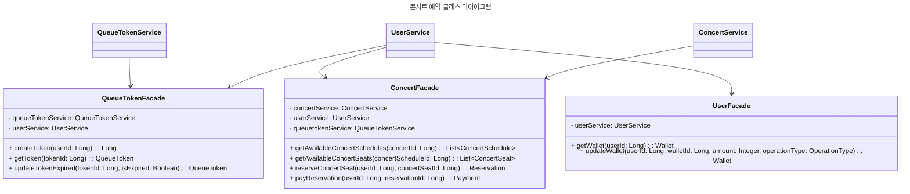
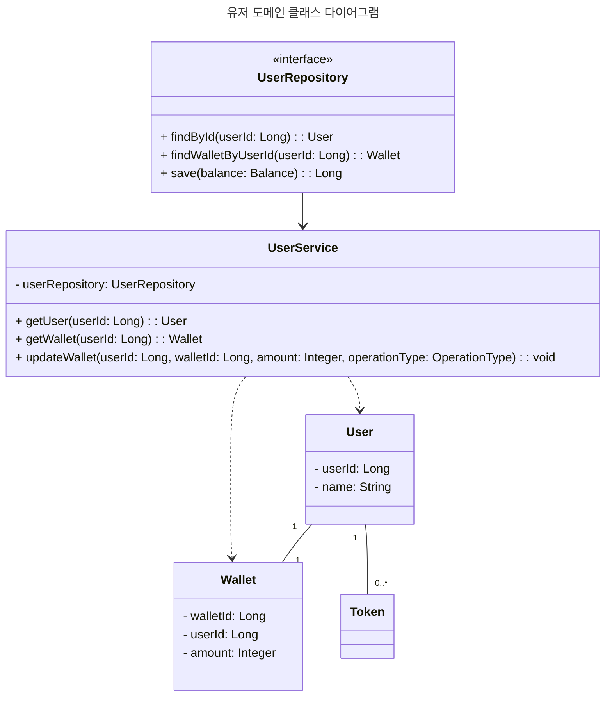
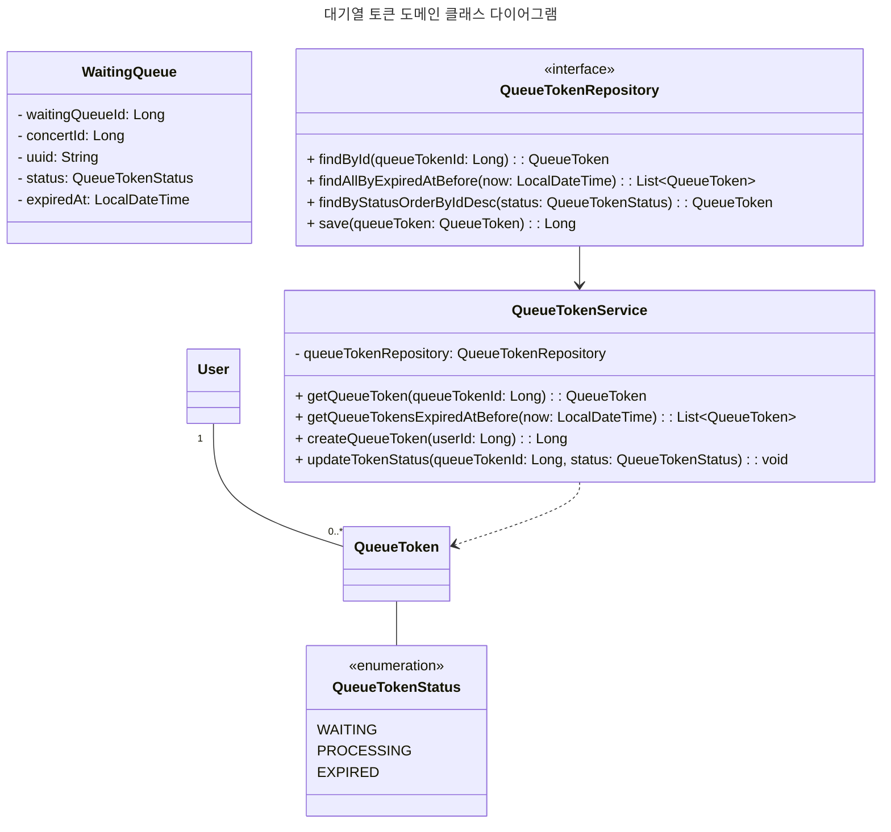
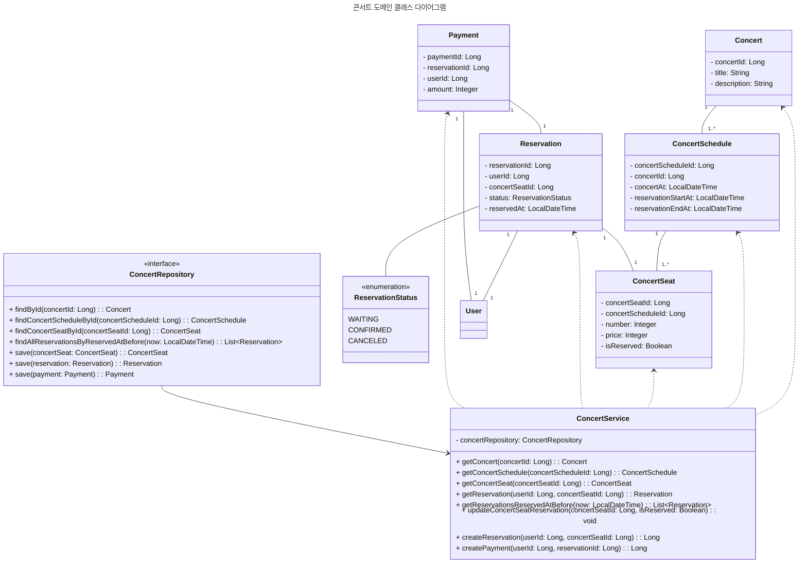

# CLASS DIAGRAM

## 콘서트 예약 클래스 다이어그램

### 전체 클래스 다이어그램

전체 클래스 다이어그램에선 파사드 위주로 작성하였습니다. (생략된 부분은 아래의 각 도메인 클래스 다이어그램을 참고해주세요.)

### 유저 도메인

### 대기열 토큰 도메인

### 콘서트 도메인

## 클래스 다이어그램 고려사항

- 도메인은 유저, 대기열 토큰, 콘서트로 구성되며, 각 도메인은 서비스 계층을 통해 접근합니다.
- 유저 도메인은 사용자 정보와 잔액을 관리하며, 잔액은 충전 및 차감이 가능합니다.
- 대기열 토큰 도메인은 사용자의 대기열 순서를 관리하며, 대기열 토큰은 만료 시간을 가집니다.
- 콘서트 도메인은 콘서트 정보, 콘서트 일정, 좌석 정보, 예약 정보, 결제 정보를 관리합니다.

### 대기열 토큰

- 대기열 토큰의 경우 상태 에 따라 대기 중인지, 처리 중인지, 만료된 상태인지를 나타내며, 만료 시간을 가집니다.
- 대기열 상태가 처리 중인 경우에 접근이 가능하다고 판단합니다.
- 대기열 상태가 처리 중으로 바뀔때 만료시간 시간을 설정하여 만료시간이 지나게 되면 만료된 상태로 변경됩니다.

### 잔액

- 잔액의 경우 충전 및 차감이 가능하며, 충전 및 차감 시에는 잔액을 업데이트 합니다.
- 잔액의 경우 User와 1:1 관계를 가지며, User가 삭제되면 잔액도 함께 삭제됩니다.
- User와 같은 생명주기이며 User가 에그리거트 루트로 잔액을 관리합니다.

### 콘서트

- 콘서트의 경우 콘서트 정보, 콘서트 일정, 좌석 정보, 예약 정보, 결제 정보를 관리합니다.
- 좌석에 대해 예약 및 결제가 진행됩니다.
- 좌석의 경우 isReserved로 예약 여부를 확인할 수 있으며 isRserved가 true가 되는 시점에 Reservation이 생성됩니다.
- 예약이 완료되면 결제가 진행되며, 결제가 완료되면 좌석이 소유권이 확정됩니다.
- 일정시간 동안 결제가 완료되지 않으면 예약이 취소됩니다.
- 좌석의 경우 충돌이 많이 발생하지만 예약이 완료된 시점에 나머지 요청은 취소되기에 낙관적 락 방식을 고려합니다.
