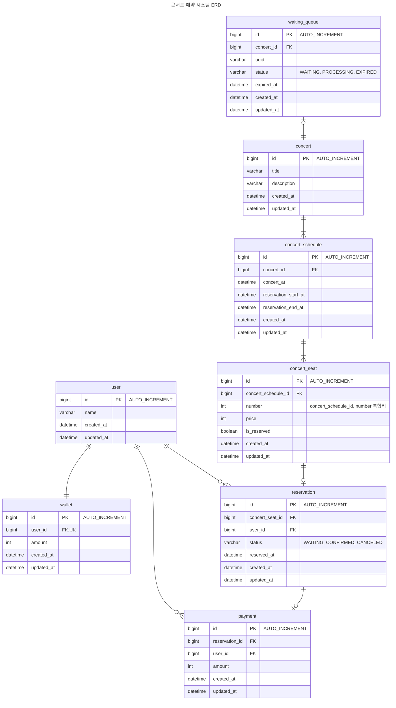

# ERD

## 콘서트 예약 시스템 ERD

모든 Entity 에는 생성 시간과 수정 시간을 관리하기 위한 공통 필드가 존재합니다.
Entity 의 생성 시간과 수정 시간이 중요하지 않은 경우에는 ERD 에선 생략하였습니다.

```mermaid
---
title: "콘서트 예약 시스템 ERD"
---

erDiagram
    user {
        bigint id PK "AUTO_INCREMENT"
        varchar name
        datetime created_at
        datetime updated_at
    }

    wallet {
        bigint id PK "AUTO_INCREMENT"
        bigint user_id FK, UK
        int amount
        datetime created_at
        datetime updated_at
    }

    waiting_queue {
        bigint id PK "AUTO_INCREMENT"
        bigint concert_id FK
        varchar uuid
        varchar status "WAITING, PROCESSING, EXPIRED"
        datetime expired_at
        datetime created_at
        datetime updated_at
    }

    concert {
        bigint id PK "AUTO_INCREMENT"
        varchar title
        varchar description
        datetime created_at
        datetime updated_at
    }

    concert_schedule {
        bigint id PK "AUTO_INCREMENT"
        bigint concert_id FK
        datetime concert_at
        datetime reservation_start_at
        datetime reservation_end_at
        datetime created_at
        datetime updated_at
    }

    concert_seat {
        bigint id PK "AUTO_INCREMENT"
        bigint concert_schedule_id FK
        int number "concert_schedule_id, number 복합키"
        int price
        boolean is_reserved
        datetime created_at
        datetime updated_at
    }

    reservation {
        bigint id PK "AUTO_INCREMENT"
        bigint concert_seat_id FK
        bigint user_id FK
        varchar status "WAITING, CONFIRMED, CANCELED"
        datetime reserved_at
        datetime created_at
        datetime updated_at
    }

    payment {
        bigint id PK "AUTO_INCREMENT"
        bigint reservation_id FK
        bigint user_id FK
        int amount
        datetime created_at
        datetime updated_at
    }

    user ||--|| wallet: ""
    waiting_queue |o--|| concert: ""
    concert ||--|{ concert_schedule: ""
    concert_schedule ||--|{ concert_seat: ""
    concert_seat ||--o| reservation: ""
    reservation ||--o| payment: ""
    user ||--o{ reservation: ""
    user ||--o{ payment: ""
```