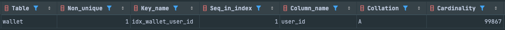
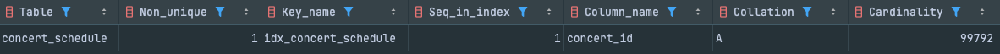
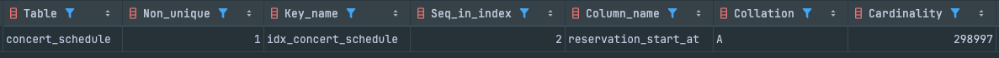
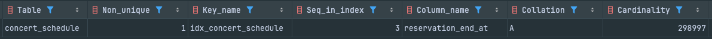
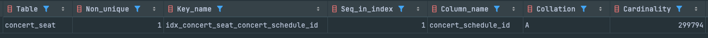
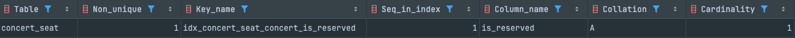
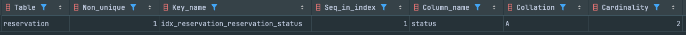
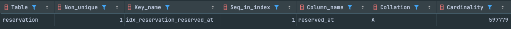

# 인덱싱을 통한 성능 개선

## 개요

이번 주차에서는 인덱스 설정을 통한 조회 쿼리에 대한 성능 개선을 다룹니다.

## 인덱스가 필요해보이는 쿼리

### 사용자 잔액 조회 쿼리

```java
walletJpaRepository.findByUserId(param.userId())
```

사용자 ID로 잔액 조회

- SQL

```sql
SELECT *
FROM wallet
WHERE user_id = ?
```

- 인덱스가 필요한 이유

    - walletId당 하나의 userId가 존재하기에 Cardinality가 높습니다.  
      
        - `SHOW INDEX FROM wallet WHERE Column_name = 'user_id';`
        - 10만건의 데이터중 Cardinality가 99867
    - 이는 B+ Tree 인덱스를 사용하면 더 빠른 조회가 가능합니다.

- JPA를 사용한 인덱스 추가

  ```java
  @Entity
  @Table(
    name = "wallet",
    indexes = {
        @Index(name = "idx_wallet_user_id", columnList = "user_id")
    }
  )
  public class Wallet extends BaseEntity {
    ...
  }
  ```

- SQL로 직접 인덱스 추가

  ```sql
  CREATE INDEX idx_wallet_user_id ON wallet(user_id);
  ```

  예시 SQL

  ```sql
  SELECT * FROM wallet WHERE user_id = 56548;
  ```

- EXPLAIN ANALYZE로 인덱스 설정 전 후 비교 (10만건의 데이터)

    - 설정 전

      ```
      -> Filter: (wallet.user_id = 56548)  (cost=10075 rows=9987) (actual time=30.2..50.5 rows=1 loops=1)
          -> Table scan on wallet  (cost=10075 rows=99867) (actual time=0.346..44.1 rows=100000 loops=1)
      ```

        - 비용(cost): 10075
        - 예상 행 수(rows): 9987
        - 실새 수행 시간(actual time): 30.2 ~ 50.5ms
        - Table Scan 유형: Table Full Scan (전체 테이블 스캔)

    - 설정 후

      ```
      -> Index lookup on wallet using idx_wallet_user_id (user_id=56548)  (cost=0.35 rows=1) (actual time=0.127..0.135 rows=1 loops=1)
      ```

        - 비용(cost): 0.35
        - 예상 행 수(rows): 1
        - 실새 수행 시간(actual time): 0.127 ~ 0.135ms
        - Table Scan 유형: Index Lookup (인덱스 조회)

비용(cost)이 10075에서 0.35로 줄었습니다.  
검색 rows도 9987에서 1로 줄었습니다.  
실제 수행 시간도 30.2 ~ 50.5ms에서 0.127 ~ 0.135ms로 줄었습니다.

### 예약 가능한 콘서트 스케줄 목록 조회 쿼리

```java
concertScheduleJpaRepository.findReservableConcertSchedulesByConcertIdAndNow(
    param.concertId(),LocalDateTime.

now());
```

콘서트 ID와 현재 시간으로 예약 가능한 콘서트 스케줄 목록 조회

- SQL

```sql
SELECT *
FROM concert_schedule
WHERE concert_id = ?
  AND reservation_start_at <= ?
  AND reservation_end_at >= ?
```

- 인덱스가 필요한 이유

    - concert 당 여러개의 concert_schedule이 존재할 수 있으나 데이터가 많아짐에 따라 concertId의 중복도는 낮습니다. (Cardinality가
      높음)
    - reservation_start_at과 reservation_end_at은 범위 검색이며 인덱스로 빠르게 조회할 수 있습니다. (Cardinality는 데이터 상황에
      따라 다르나 데이터가 쌓이면 높아질 수 있음)
    - 카디널리티로만 보면 reservation_start_at과 reservation_end_at이 높아보이지만, 이 둘을 조합하여 조회하는 경우보단 concert_id와
      조합하여 조회하는 경우가 더 많을 것이기에 순서를 concert_id로 먼저 설정합니다. (데이터 환경에 따라 카디널리티의 크기는 달라질 수 있음)  
      

        - `SHOW INDEX FROM concert_schedule WHERE Column_name = 'concert_id';`
        - 30만건의 데이터중 Cardinality가 99792 (concert 하나당 3개의 schedule이 존재, date는 랜덤)

      

        - `SHOW INDEX FROM concert_schedule WHERE Column_name = 'reservation_start_at';`
        - 30만건의 데이터중 Cardinality가 298997

      

        - `SHOW INDEX FROM concert_schedule WHERE Column_name = 'reservation_end_at';`
        - 30만건의 데이터중 Cardinality가 298997

    - 이는 B+ Tree 인덱스를 사용하면 더 빠른 조회가 가능합니다.

- JPA를 사용한 인덱스 추가

  ```java
  @Entity
  @Table(
    name = "concert_schedule",
    indexes = {
        @Index(
          name = "idx_concert_schedule",
          columnList = "concert_id, reservation_start_at, reservation_end_at"
        )
    }
  )
  public class ConcertSchedule extends BaseEntity {
    ...
  }
  ```

- SQL로 직접 인덱스 추가

  ```sql
  CREATE INDEX idx_concert_schedule ON concert_schedule (concert_id, reservation_start_at, reservation_end_at);
  ```

  예시 SQL

  ```sql
  SELECT * FROM concert_schedule WHERE concert_id = 56489 AND reservation_start_at <= '2024-10-26 00:00:00' AND reservation_end_at >= '2024-10-26 00:00:00';
  ```

- EXPLAIN ANALYZE로 인덱스 설정 전 후 비교 (30만건의 데이터)

    - 설정 전

  ```
  -> Filter: ((concert_schedule.concert_id = 56489) and (concert_schedule.reservation_start_at <= TIMESTAMP'2024-10-26 00:00:00') and (concert_schedule.reservation_end_at >= TIMESTAMP'2024-10-26 00:00:00'))  (cost=30212 rows=3322) (actual time=57.7..94.9 rows=1 loops=1)
    -> Table scan on concert_schedule  (cost=30212 rows=298997) (actual time=0.635..82.7 rows=300000 loops=1)
  ```

    - 비용(cost): 30212
    - 예상 행 수(rows): 3322
    - 실제 수행 시간(actual time): 57.7 ~ 94.9ms
    - Table Scan 유형: Table Full Scan (전체 테이블 스캔)

    - 설정 후

  ```
    -> Index range scan on concert_schedule using idx_concert_schedule over (concert_id = 56489 AND reservation_start_at <= '2024-10-26 00:00:00.000000'), with index condition: ((concert_schedule.concert_id = 56489) and (concert_schedule.reservation_start_at <= TIMESTAMP'2024-10-26 00:00:00') and (concert_schedule.reservation_end_at >= TIMESTAMP'2024-10-26 00:00:00'))  (cost=1.16 rows=2) (actual time=0.259..0.313 rows=1 loops=1)
  ```

    - 비용(cost): 1.16
    - 예상 행 수(rows): 2
    - 실제 수행 시간(actual time): 0.259 ~ 0.313ms
    - Table Scan 유형: Index Range Scan (인덱스 범위 스캔)

비용(cost)이 30212에서 1.16로 줄었습니다.  
검색 rows도 3322에서 2로 줄었습니다.  
실제 수행 시간도 57.7 ~ 94.9ms에서 0.259 ~ 0.313ms로 줄었습니다.

### 예약 가능한 콘서트 좌석 조회 쿼리

```java
concertSeatJpaRepository.findReservableConcertSeatsByConcertScheduleId(param.concertScheduleId());
```

콘서트 스케줄 ID로 예약 가능한 콘서트 좌석 조회

- SQL

```sql
SELECT *
FROM concert_seat
WHERE concert_schedule_id = ?
  AND is_reserved = false
```

- 인덱스가 필요한 이유

    - concert_schedule_id당 여러개의 concert_seat이 존재할 수 있으나 데이터가 많아짐에 따라 concertScheduleId의 중복도는 낮습니다. (
      Cardinality가 높음)
      
        - `SHOW INDEX FROM concert_seat WHERE Column_name = 'concert_schedule_id';`
        - 약 120만건의 데이터중 Cardinality가 299794
    - is_reserved는 boolean 값이기에 Cardinality가 낮습니다.
      
        - `SHOW INDEX FROM concert_seat WHERE Column_name = 'is_reserved';`
        - 약 120만건의 데이터중 Cardinality가 1
    - 이는 B+ Tree 인덱스를 사용하면 더 빠른 조회가 가능합니다.

- JPA를 사용한 인덱스 추가

  ```java
  @Entity
  @Table(
    name = "concert_seat",
    indexes = {
        @Index(
          name = "idx_concert_seat_concert_schedule_id",
          columnList = "concert_schedule_id"
        )
    }
  )
  public class ConcertSeat extends BaseEntity {
    ...
  }
  ```

- SQL로 직접 인덱스 추가

```sql
CREATE INDEX idx_concert_seat_concert_schedule_id ON concert_seat (concert_schedule_id);
```

예시 SQL

```sql
SELECT *
FROM concert_seat
WHERE concert_schedule_id = 56489
  AND is_reserved = false;
```

- EXPLAIN ANALYZE로 인덱스 설정 전 후 비교 (120만건의 데이터)

    - 설정 전
      ```
      -> Filter: ((concert_seat.is_reserved = false) and (concert_seat.concert_schedule_id = 56489))  (cost=120728 rows=59775) (actual time=506..610 rows=1 loops=1)
        -> Table scan on concert_seat  (cost=120728 rows=1.2e+6) (actual time=0.0762..493 rows=1.2e+6 loops=1)
      ```
        - 비용(cost): 120728
        - 예상 행 수(rows): 59775
        - 실제 수행 시간(actual time): 506 ~ 610ms
        - Table Scan 유형: Table Full Scan (concert_seat 테이블 전체 스캔)
    - 설정 후

      ```
      -> Filter: (concert_seat.is_reserved = false)  (cost=1.2 rows=2) (actual time=0.0983..0.112 rows=1 loops=1)
        -> Index lookup on concert_seat using idx_concert_seat_concert_schedule_id (concert_schedule_id=56489)  (cost=1.2 rows=4) (actual time=0.0791..0.0946 rows=4 loops=1)
      ```

        - 비용(cost): 1.2
        - 예상 행 수(rows): 2
        - 실제 수행 시간(actual time): 0.0983 ~ 0.112ms
        - Table Scan 유형: Index Lookup (인덱스 조회)

비용(cost)이 120728에서 1.2로 줄었습니다.  
검색 rows도 59775에서 2로 줄었습니다.  
실제 수행 시간도 506 ~ 610ms에서 0.0983 ~ 0.112ms로 줄었습니다.

### 만료 처리가 필요한 예약 내역 조회 쿼리

```java
reservationJpaRepository.findAllExpiredReservationsWithLock(param.expiredAt());
```

만료 시간이 지나고 만료처리가 안된 예약 내역 조회

- SQL

@Query("SELECT r FROM Reservation r WHERE r.status = 'WAITING' AND r.reservedAt < :expiredAt")

```sql
SELECT *
FROM reservation
WHERE status = 'WAITING'
  AND reserved_at < ?
```

- 인덱스가 필요한 이유

    - status는 enum 값이기에 Cardinality가 낮으며 수정 가능성이 높습니다.
      
        - `SHOW INDEX FROM reservation WHERE Column_name = 'status';`
        - 약 60만건의 데이터중 Cardinality가 2
    - reserved_at은 범위 검색이며 인덱스로 빠르게 조회할 수 있습니다. (Cardinality는 데이터 상황에 따라 다르나 데이터가 쌓이면 높아질 수 있음)
      
        - `SHOW INDEX FROM reservation WHERE Column_name = 'reserved_at';`
        - 약 60만건의 데이터중 Cardinality가 597779
    - 이는 B+ Tree 인덱스를 사용하면 더 빠른 조회가 가능합니다.

- JPA를 사용한 인덱스 추가

  ```java
  @Entity
  @Table(
    name = "reservation",
    indexes = {
        @Index(
          name = "idx_reservation_reserved_at",
          columnList = "reserved_at"
        )
    }
  )
  public class Reservation extends BaseEntity {
  ...
  }
  ```

- SQL로 직접 인덱스 추가

  ```sql
  CREATE INDEX idx_reservation_reserved_at ON reservation(reserved_at);
  ```

  예시 SQL

  ```sql
  SELECT * FROM reservation WHERE status = 'WAITING' AND reserved_at < '2024-10-26 00:00:00';
  ```

- EXPLAIN ANALYZE로 인덱스 설정 전 후 비교 (약 60만건의 데이터)

    - 설정 전

      ```
      -> Filter: ((reservation.`status` = 'WAITING') and (reservation.reserved_at < TIMESTAMP'2024-10-26 00:00:00'))  (cost=60331 rows=99630) (actual time=168..168 rows=0 loops=1)
        -> Table scan on reservation  (cost=60331 rows=597779) (actual time=0.178..132 rows=599779 loops=1)
      ```

        - 비용(cost): 60331
        - 예상 행 수(rows): 99630
        - 실제 수행 시간(actual time): 168ms
        - Table Scan 유형: Table Full Scan (전체 테이블 스캔)

    - 설정 후
      ```
      -> Filter: ((reservation.`status` = 'WAITING') and (reservation.reserved_at < TIMESTAMP'2024-10-26 00:00:00'))  (cost=60331 rows=99630) (actual time=149..149 rows=0 loops=1)
      -> Table scan on reservation  (cost=60331 rows=597779) (actual time=0.244..115 rows=599779 loops=1)
      ```
        - 비용(cost): 60331
        - 예상 행 수(rows): 99630
        - 실제 수행 시간(actual time): 149ms
        - Table Scan 유형: Table Full Scan (전체 테이블 스캔)

인덱스를 추가했지만 인덱스를 사용하지 않고 전체 테이블 스캔을 하여 성능이 개선되지 않았습니다. 이는 옵티마이저가 인덱스를 통한 조회 비용이 테이블을 직접 스캔하는 것보다 비싸다고
판단했기 때문입니다. 인덱스를 사용하게 되면, 인덱스를 통해 PK를 찾고 해당 PK를 통해 테이블을 조회해야 하므로 단일 레코드 조회의 경우 인덱스 비용이 더 높게 산출될 수
있습니다.

그러나 인덱스를 사용하면, PK를 통해 레코드를 저장된 위치에서 직접 가져올 수 있어 디스크 읽기 횟수가 줄어들고 검색 속도가 빨라집니다. 이것이 인덱스의 주요 이점입니다. 반면,
조회해야 할 레코드 수가 전체 테이블 레코드의 20~25%를 초과하는 경우, 테이블 전체를 읽는 것이 더 효율적이며, 이때 옵티마이저는 인덱스를 사용하지 않습니다.

이번 경우 `reserved_at`이 `'2024-10-26 00:00:00'`으로 설정된 조건에 해당하는 데이터가 284,903건으로, 전체 데이터의 47.5%에 해당하여
인덱스가 사용되지 않았습니다. 그러나 이 쿼리는 스케줄링을 통해 주기적으로 수행될 예정이며, 데이터가 많아지더라도 20%를 초과하는 경우는 없을 것으로 판단하여, 실질적인 조회를
위해 `reserved_at` 값을 20% 미만인 약 6만 건에 해당하는 `'2024-02-01 00:00:00'`으로 변경하였습니다.

- 변경 후

  ```
  -> Filter: (reservation.`status` = 'WAITING')  (cost=60616 rows=44901) (actual time=104..104 rows=0 loops=1)
    -> Index range scan on reservation using idx_reservation_reserved_at over (reserved_at < '2024-02-01 00:00:00.000000'), with index condition: (reservation.reserved_at < TIMESTAMP'2024-02-01 00:00:00')  (cost=60616 rows=134702) (actual time=0.0511..100 rows=64644 loops=1)
  ```

    - 비용(cost): 60616
    - 예상 행 수(rows): 44901
    - 실제 수행 시간(actual time): 104ms
    - Table Scan 유형: Index Range Scan (인덱스 범위 스캔)

비용(cost)이 60331에서 60616로 증가했습니다.  
검색 rows는 99630에서 44901로 줄었습니다.  
실제 수행 시간은 168ms에서 104ms로 줄었습니다.

아직도 많은 rows 조회하기에 비용이 증가했지만, 실제 수행 시간은 줄어들었습니다. 실제 환경에선 스케줄링을 통해 주기적으로 수행되기에, 데이터가 많아지더라도 20%를 초과하는
경우는 없을 것으로 판단하여, 성능 개선을 위해 인덱스를 추가하였습니다.

## 결론

인덱스 설정을 통해 조회 쿼리 성능을 개선할 수 있습니다. 인덱스 생성 기준으로는 중복도가 낮아 카디널리티(Cardinality)가 높은지, 해당 조건이 자주 사용되는지, 인덱스
설정 컬럼에 대한 업데이트 빈도가 높은지 등을 고려했습니다. 카디널리티가 높은 컬럼은 B+ Tree 인덱스를 사용하여 조회 속도를 크게 향상시킬 수 있었으며, 업데이트가 빈번한
컬럼은 인덱스 삭제 및 추가 시 비용이 증가할 수 있으므로 신중한 설정이 필요합니다. 복합 인덱스의 경우, 컬럼의 순서와 카디널리티 및 조건 사용 빈도를 고려해 설정하는 것이
중요합니다.
