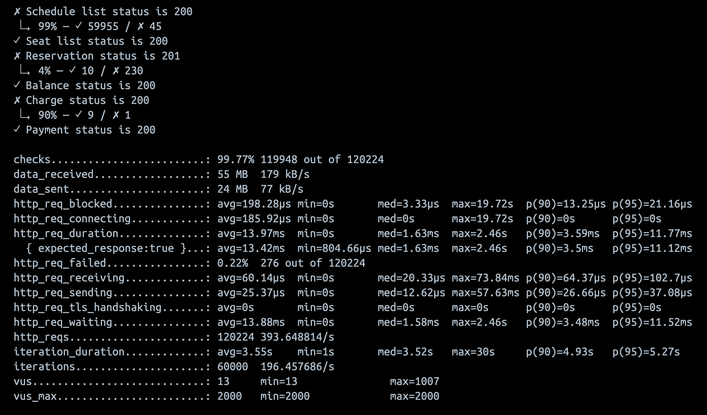

# 부하 테스트 대상 선정 및 목적

## 1. 개요

### 목적

콘서트 예약 서비스의 부하 테스트를 통해 **시스템의 성능과 안정성을 검증**하고, 병목 구간을 식별하여 **개선 방향을 도출**합니다.

### 배경

콘서트 예약 서비스는 **대규모 트래픽**이 예상되는 환경에서 **동시 접속과 높은 처리량**이 중요한 요소입니다. 특히, 대기열 발급 및 예매 과정에서 성능 저하나 장애가
발생하지 않도록 사전 점검이 필수적입니다.

## 2. 테스트 목표

1. 대기열 발급 프로세스와 예매 시나리오의 **성능 및 안정성**을 평가.
2. 주요 성능 지표를 측정하여 병목 구간을 식별:

- 응답 시간 (Response Time)
- 처리량 (Throughput)
- 오류율 (Error Rate)

3. 결과 분석을 통해 **개선 방향**을 제시.

## 3. 테스트 범위

### 대기열 발급 시나리오

1. 점진적으로 증가하는 사용자 요청 처리 성능 평가.
2. 요청 증가 및 감소에 따른 서버의 안정성 검증.

### 예매 시나리오

1. 예약 가능한 일정 조회.
2. 예약 가능한 좌석 조회.
3. 좌석 선택 및 예약 요청.
4. 사용자 잔액 조회 및 충전 요청.
5. 결제 완료 요청.

## 4. 테스트 환경

### 하드웨어 사양

- **CPU:** 2 vCPU
- **메모리:** 4GB

### 소프트웨어 스택

- **애플리케이션 서버:** Spring Boot 3.x
- **데이터베이스:** MySQL 8.0
- **캐시:** Redis 7.4.1

### 테스트 도구

- **부하 테스트 도구:** k6

## 5. 테스트 계획

### 5.1 대기열 발급 시나리오

#### 목적

- 점진적으로 증가하는 트래픽에 대해 대기열 발급 프로세스의 **성능과 안정성**을 평가.
- 최대 부하 상태에서 서버의 응답 속도와 장애 여부를 검증.

#### 설정

- **가상 사용자 수(VUs):**
    - 최대 5000명.
- **부하 증가 및 감소 패턴:**
    - 점진적으로 가상 사용자를 증가시키며 최대 부하를 유지한 후 감소.
- **테스트 시간:** 약 5분.

#### k6 설정

```js
import http from 'k6/http';
import {check, sleep} from 'k6';

export const options = {
  scenarios: {
    queue_test: {
      executor: 'ramping-vus',
      startVUs: 0, // 초기 사용자 0명
      stages: [
        {duration: '30s', target: 500},  // 30초 동안 500명까지 증가
        {duration: '1m', target: 2000},  // 1분 동안 2000명까지 증가
        {duration: '1m', target: 5000},  // 1분 동안 5000명까지 증가
        {duration: '30s', target: 5000}, // 30초 동안 5000명 유지
        {duration: '1m', target: 0},     // 1분 동안 0명으로 감소
      ],
    },
  },
};

export default function () {
  // Step 1: 대기열 토큰 발급
  const createResponse = http.post(
      'http://host.docker.internal:8080/api/v1/waiting-queues/tokens',
      {
        headers: {
          'Content-Type': 'application/json',
        },
      }
  );

  check(createResponse, {
    'Token creation status is 201': (r) => r.status === 201,
  });

  let tokenId = createResponse.json()?.waitingQueue.uuid;

  // Step 2: 5초 간격으로 대기열 조회
  let waitingQueue = null;

  while (true) {
    const queryResponse = http.get(
        'http://host.docker.internal:8080/api/v1/waiting-queues/position',
        {
          headers: {
            'Content-Type': 'application/json',
            'X-Waiting-Queue-Token-uuid': tokenId,
          },
        }
    );

    check(queryResponse, {
      'Query status is 200': (r) => r.status === 200,
    });

    waitingQueue = queryResponse.json().waitingQueue;

    if (waitingQueue?.position === 0) {
      console.log(`Token ${tokenId} entered the queue.`);
      break;
    }

    // 5초 대기
    sleep(5);
  }
}
```


### 5.2 예매 시나리오

#### 목적

- 예약 프로세스의 여러 단계가 병목 없이 처리되는지 확인.
- 초당 요청 속도를 일정하게 유지하며 서버의 처리 용량과 안정성을 평가.

#### 설정

- **초당 요청 속도(TPS):** 3000
- **최대 가상 사용자 수(VUs):** 2000명.
- **`maxVUs`:** 2400명 (20% 여유).
- **단계별 대기 시간:** 사용자 행동을 반영하여 각 단계에 `0.5~3초`의 대기 시간 추가.
- **테스트 지속 시간:** 5분.

#### k6 설정

```js
import http from 'k6/http';
import {check, fail, sleep} from 'k6';

export const options = {
  scenarios: {
    booking_scenario: {
      executor: 'constant-arrival-rate',
      rate: 200, // 초당 요청 속도 (TPS)
      timeUnit: '1s',
      duration: '5m', // 테스트 지속 시간: 5분
      preAllocatedVUs: 2000, // 최대 가상 사용자 수
      maxVUs: 2400, // 최대 VUs (20% 여유)
    },
  },
};

// 랜덤 대기 시간 함수: 0.5초 ~ 3초 사이의 값을 반환
function getRandomWaitTime(min = 0.5, max = 3) {
  return Math.random() * (max - min) + min;
}

export default function () {
  const concertId = 1;
  const tokenId = 'test';
  const userId = 1;
  const walletId = 1;

  // Step 1: 예약 가능한 일정 조회
  const scheduleResponse = http.get(
      `http://host.docker.internal:8080/api/v1/concerts/${concertId}/available-schedules`,
      {
        headers: {
          'Content-Type': 'application/json',
          'X-Waiting-Queue-Token-uuid': tokenId,
        },
      }
  );

  if (!check(scheduleResponse,
      {'Schedule list status is 200': (r) => r.status === 200})) {
    fail(
        `Schedule list request failed with status: ${scheduleResponse.status}`);
  }
  sleep(getRandomWaitTime()); // 랜덤 대기

  const schedules = scheduleResponse.json().concertSchedules;
  if (!schedules || schedules.length === 0) {
    fail('No schedules available for booking.');
  }

  let randomIndex = Math.floor(Math.random() * schedules.length);
  const concertScheduleId = schedules[randomIndex].id;

  // Step 2: 예약 가능한 좌석 조회
  const seatResponse = http.get(
      `http://host.docker.internal:8080/api/v1/concert-schedules/${concertScheduleId}/available-seats`,
      {
        headers: {
          'Content-Type': 'application/json',
          'X-Waiting-Queue-Token-uuid': tokenId,
        },
      }
  );

  if (!check(seatResponse,
      {'Seat list status is 200': (r) => r.status === 200})) {
    fail(`Seat list request failed with status: ${seatResponse.status}`);
  }
  sleep(getRandomWaitTime()); // 랜덤 대기

  const seats = seatResponse.json().concertSeats;
  if (!seats) {
    fail('No seats available for booking.');
  }

  if (seats.length === 0) {
    return; // 예약 가능한 좌석이 없으면 종료
  }

  randomIndex = Math.floor(Math.random() * seats.length);
  const seatId = seats[randomIndex].id;

  // Step 3: 좌석 선택 및 예약 요청
  const reserveResponse = http.post(
      `http://host.docker.internal:8080/api/v1/concert-seats/${seatId}/reservation`,
      {},
      {
        headers: {
          'Content-Type': 'application/json',
          'X-Waiting-Queue-Token-uuid': tokenId,
          'X-User-Id': userId,
        },
      }
  );

  if (!check(reserveResponse,
      {'Reservation status is 201': (r) => r.status === 201})) {
    fail(`Reservation request failed with status: ${reserveResponse.status}`);
  }
  sleep(getRandomWaitTime()); // 랜덤 대기

  const reservation = reserveResponse.json()?.reservation;
  if (!reservation) {
    fail('Reservation response does not contain reservation details.');
  }

  const reservationId = reservation.id;

  // Step 4: 사용자 잔액 조회 및 충전 요청
  const balanceResponse = http.get(
      `http://host.docker.internal:8080/api/v1/users/${userId}/wallets`,
      {
        headers: {
          'Content-Type': 'application/json',
        },
      }
  );

  if (!check(balanceResponse,
      {'Balance status is 200': (r) => r.status === 200})) {
    fail(`Balance request failed with status: ${balanceResponse.status}`);
  }

  sleep(getRandomWaitTime()); // 랜덤 대기

  const chargeResponse = http.put(
      `http://host.docker.internal:8080/api/v1/users/${userId}/wallets/${walletId}/charge`,
      JSON.stringify({amount: 10000}),
      {
        headers: {
          'Content-Type': 'application/json',
          'X-Waiting-Queue-Token-uuid': tokenId,
        },
      }
  );

  if (!check(chargeResponse,
      {'Charge status is 200': (r) => r.status === 200})) {
    console.log(chargeResponse);
    fail(`Charge request failed with status: ${chargeResponse.status}`);
  }
  sleep(getRandomWaitTime()); // 랜덤 대기

  // Step 5: 결제 완료 요청
  const paymentResponse = http.post(
      `http://host.docker.internal:8080/api/v1/reservations/${reservationId}/payments`,
      {},
      {
        headers: {
          'Content-Type': 'application/json',
          'X-Waiting-Queue-Token-uuid': tokenId,
          'X-User-Id': userId,
        },
      }
  );

  if (!check(paymentResponse,
      {'Payment status is 200': (r) => r.status === 200})) {
    fail(`Payment request failed with status: ${paymentResponse.status}`);
  }
  sleep(getRandomWaitTime()); // 랜덤 대기
}
```

