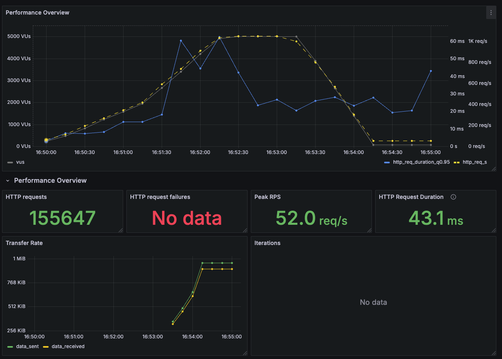
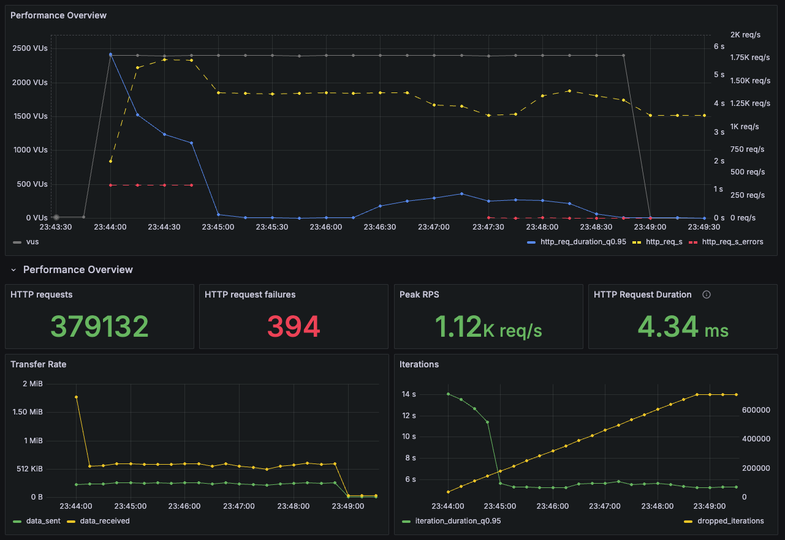
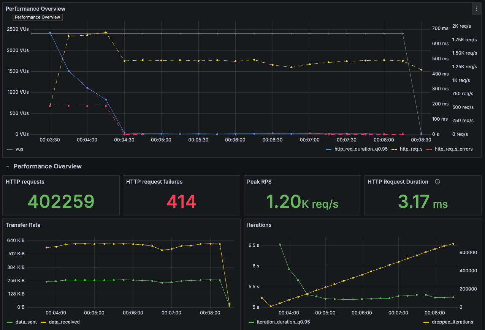

# 부하 테스트 결과 분석 및 가상 장애 대응 문서

## 1. 개요

이 문서는 콘서트 예약 서비스에 대한 부하 테스트 결과를 기반으로 시스템의 현재 성능 상태를 평가하고, 예상되는 장애 상황에 대한 대응 방안을 제시합니다. 이를 통해 대규모 트래픽
상황에서도 안정적인 서비스 운영이 가능하도록 필요한 전략과 개선 방향을 정리했습니다.

## 2. 모니터링 설정

### 2.1. 사용 도구

이번 부하 테스트에서는 다음 도구를 활용해 테스트를 진행하고 결과를 분석했습니다.

- **k6**: 시나리오 기반 부하 테스트 도구로 다양한 트래픽 상황을 재현.
- **Prometheus**: 메트릭 데이터를 수집하고 저장하는 시스템.
- **Grafana**: 수집된 데이터를 시각화해 한눈에 확인할 수 있는 대시보드 제공.

### 2.2. Prometheus를 선택한 이유

Prometheus는 Grafana와의 **프로비저닝(Provisioning)** 기능을 통해 데이터 소스 및 대시보드를 자동으로 구성할 수 있다는 장점이 있습니다. 이를 통해
복잡한 설정 과정을 생략하고 효율적으로 모니터링 환경을 구축할 수 있었습니다.

### 2.3. 자동화 구현

- **데이터 소스 등록**: Prometheus를 Grafana 데이터 소스로 등록하고 필요한 대시보드를 코드로 정의.
- **대시보드 구성**: 응답 시간, 요청 처리량, 에러율 등의 주요 메트릭을 중심으로 시각화.

## 3. 부하 테스트 결과 분석

### 3.1. 대기열 시나리오

- **Error Rate**: 0%
- **p95 응답 시간**: 62.5ms  
  대기열 관련 기능은 매우 안정적인 상태로, 트래픽 처리 성능이 충분히 확보된 것을 확인했습니다.

### 3.2. 예약 시나리오

- **Error Rate**: 0.64% (총 394건 실패)
    - 주요 에러: 충전 금액 초과, 이미 예약된 좌석 오류.
- **p95 응답 시간**: 5.74s
  초기 트래픽 부하 및 좌석 충돌로 인해 응답 시간이 높아지는 현상이 관찰되었습니다.

## 4. 가상 장애 보고서

### 4.1. 장애 개요

- **발생 시점**: 부하 테스트 중
- **발생 서비스**: 콘서트 예약 시스템
- **장애 유형**: 응답 시간 지연
- **주요 증상**: 예약 시나리오에서 **p95 응답 시간이 5.74초**로 상승하여 정상적인 대기열 시나리오(p95 응답 시간 62.5ms)와 비교했을 때 과도한 응답 시간
  증가가 발생하였습니다.
- **판단 기준**: p95 응답 시간이 SLO(Site-Level Objective) 기준인 1초 이내여야 합니다.

### 4.2. 장애 원인 분석

#### 주요 원인

1. **캐시 스탬피드(Cache Stampede) 발생**
    - Redis 캐시 만료로 인해 다수의 요청이 동시에 데이터베이스를 참조하면서 과부하가 발생했습니다.
    - 캐시 미스(Cache Miss)가 빈번해지면서 데이터베이스 트래픽이 급격히 증가하였고, 이는 응답 시간 지연으로 이어졌습니다.

### 4.3. 조치 사항 및 결과

#### 조치 사항

1. **캐시 워밍(Cache Warming) 도입**
    - 예약 시작 3분 전에 콘서트 정보와 스케줄 데이터를 미리 캐싱하여 초기 부하를 완화했습니다.

2. **캐시 만료 정책 변경**
    - 기존에 2분으로 설정되어 있던 콘서트 및 스케줄 정보 캐시 만료 시간을 5분으로 연장해 캐시 갱신 빈도를 줄였습니다.

#### 조치 결과

- 예약 시나리오에서 **p95 응답 시간**이 5.74초에서 **676ms**로 개선되었으며, SLO 기준(1초 이내)을 충족했습니다.
- 캐시 히트율(Cache Hit Rate)이 증가하면서 데이터베이스 호출 빈도가 크게 줄어들었습니다.

### 4.4. 향후 개선 방안

1. **모니터링 및 알림 시스템 구축**
    - 캐시 미스율(Cache Miss Rate)과 데이터베이스 부하를 실시간으로 모니터링할 수 있는 시스템을 마련합니다.
    - Redis 캐시 만료가 임박하거나 캐시 미스율이 급증할 경우, 알림을 통해 빠르게 대응할 수 있는 체계를 마련합니다.

2. **대기열 트래픽 분산**
    - 활성 대기열의 요청 수를 줄이고 트래픽을 효과적으로 분산하여 서버 부하를 완화합니다.

### 4.5. 결론

이번 장애는 Redis 캐시 만료로 인한 **캐시 스탬피드 현상**으로 데이터베이스 부하가 급격히 증가하면서 발생한 응답 시간 지연이 주요 원인이었습니다.  
`캐시 워밍 도입`과 `캐시 만료 정책 변경`을 통해 문제를 해결했으며, 향후 모니터링 시스템과 대기열 트래픽 분산을 통해 보다 안정적인 서비스 운영을 목표로 할 계획입니다.    