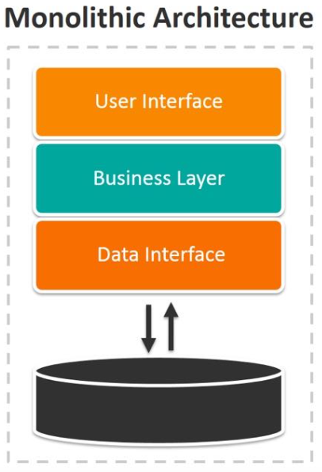
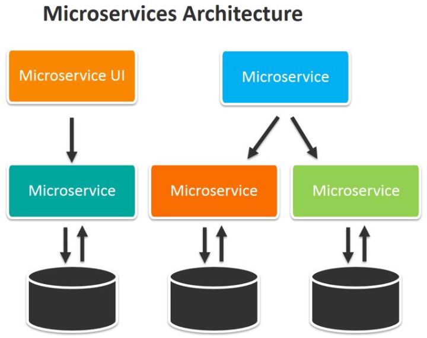

# MSA 관점에서 트랜잭션 관리

## 개요

현재 프로젝트는 모놀리식(Monolithic) 아키텍처로 설계되어 있습니다. 하지만 서비스 규모가 점차 커지면서 빌드 시간도 늘어나고 릴리스 관리가 복잡해지는 문제가 발생할 수
있습니다. 또한, 각 서비스의 역할을 명확히 분리하고 유지 보수성을 높이기 위해 MSA(Microservice Architecture)로 전환할 필요성을 느낄 수 있습니다. 이번
보고서에서는 MSA로의 전환을 준비하기 위한, 주요 유스케이스인 콘서트 예약과 결제 처리를 예로 들어 트랜잭션 관리에 대한 과제와 해결 방안을 함께 살펴보고자 합니다.

## 현재 시스템 분석

현재 시스템은 `ConcertFacade`라는 모놀리식 구조로 구성되어 있으며, 다음과 같은 주요 서비스들이 통합되어 있습니다.

- `User(Command|Query)Service` - 사용자 정보 관리
- `WaitingQueueCommandService` - 대기열 관리
- `Concert(Command|Query)Service` - 콘서트 정보 관리
- `Payment(Command|Query)Service` - 결제 정보 관리

MSA로 전환할 경우, 위의 각 서비스들은 개별 마이크로서비스로 분리될 예정입니다. 이에 따라, 서비스 간 독립성을 보장하면서도 트랜잭션 일관성을 유지하기 위한 새로운 트랜잭션
관리 전략이 필요하게 됩니다.

## 모놀리식 아키텍처에서의 트랜잭션 관리 방식과 문제점

### 모놀리식 아키텍처 개요



모놀리식 아키텍처는 하나의 애플리케이션 안에 모든 기능이 통합되어 있는 구조입니다. 현재 시스템에서도 사용자, 대기열, 콘서트 예약, 결제 처리가 모두 한 곳에서 이루어지고 있어
트랜잭션 관리가 상대적으로 용이하지만 몇 가지 한계가 존재합니다.

### 모놀리식 아키텍처에서의 트랜잭션 처리 방식과 문제점

현재 모놀리식 구조에서는 트랜잭션 처리를 다음과 같은 방식으로 진행하고 있습니다.

```java

@Transactional
public Payment payReservation(Long reservationId, Long userId, String queueToken) {
  // 1. 예약 내역 조회 및 사용자 조회
  // 2. 결제 처리 및 결제 내역 저장
  // 3. 예약 상태 변경
  // 4. 대기열 토큰 만료 처리
  // 5. 결제 내역 반환
}
```

이 방식은 하나의 트랜잭션 안에서 전체 결제 과정을 처리하여 일관성을 유지할 수 있지만, 다음과 같은 문제들이 발생합니다:

1. **트랜잭션 범위의 확대**: 모든 처리 과정을 하나의 트랜잭션으로 묶다 보니, 트랜잭션 범위가 넓어져 DB 커넥션을 오랫동안 점유하게 됩니다. 이는 동시 요청이 많아질 경우
   병목을 초래하고, 시스템의 응답 속도를 저하시킬 수 있습니다.

2. **서비스 간 결합도 증가**: 결제 프로세스 안에 사용자 정보 조회, 예약 정보 업데이트, 대기열 관리 등이 모두 포함되어 있어 서비스 간 결합도가 높아집니다. 이러한
   구조에서는 각 서비스를 독립적으로 확장하거나 유지 보수하는 데 어려움이 있을 수 있습니다.

이러한 문제들은 시스템의 유연성과 확장성을 저해할 뿐만 아니라, 장애 발생 시 빠르게 대응하기 어렵게 만듭니다. 따라서 MSA로 전환하면서 각 서비스의 독립성을 유지하고 트랜잭션을
효율적으로 관리할 수 있는 방안을 모색해야 합니다.

## MSA 전환 시 트랜잭션 관리 방안

### MSA 아키텍처 개요



MSA는 개별 서비스가 독립적으로 배포 및 운영될 수 있는 구조로, 각 서비스는 자체적인 데이터베이스를 사용하고 독립적인 트랜잭션을 관리하게 됩니다. 이처럼 서비스가 분리되면
네트워크 통신이 필수적이 되며, 이에 따라 트랜잭션 관리가 더욱 복잡해질 수 있습니다.

### MSA에서의 트랜잭션 처리 방식

MSA로 전환할 경우, 각 서비스는 자체적으로 트랜잭션을 관리해야 합니다. 예를 들어, 다음과 같이 `Payment`, `Reservation`, `Queue` 각각의 서비스가
독립적으로 트랜잭션을 관리하도록 설계할 수 있습니다.

```java
// Payment 서비스 트랜잭션 예시
@Transactional
public Payment executePayment(Long userId, Long amount) {
  // 결제 로직 실행
  // 결제 내역 저장
}
```

```java
// Reservation 서비스 트랜잭션 예시
@Transactional
public Reservation reserveConcert(Long userId, Long concertId) {
  // 예약 로직 실행
  // 예약 내역 저장
}
```

이러한 방식으로 개별 서비스에서 트랜잭션을 관리하면 각 서비스의 독립성을 보장할 수 있어 확장성과 장애 대응 능력이 강화됩니다. 그러나 다수의 서비스가 관여하는 트랜잭션의 경우
일관성을 유지하기 위해 롤백을 포함한 보상 트랜잭션이 필요할 수 있으며, 이를 위해 **Saga Pattern**을 도입할 수 있습니다.

## Saga Pattern

### Saga Pattern 개요

Saga Pattern은 MSA 환경에서 데이터 일관성을 유지하기 위한 트랜잭션 관리 방식입니다. 각 서비스는 로컬 트랜잭션을 통해 작업을 처리하고, 다음 작업으로 진행하기 위해
이벤트나 메시지를 발행합니다. 만약 트랜잭션 과정에서 오류가 발생하면, 보상 트랜잭션을 통해 이전 작업의 데이터를 원상 복구하여 데이터 정합성을 유지합니다.

### Saga Pattern의 방식

Saga Pattern은 **Orchestration**과 **Choreography** 방식으로 나뉘어 각각의 장단점을 가지고 있습니다:

- **Orchestration 방식**: Saga Manager라는 중앙 관리자가 각 서비스의 트랜잭션을 제어하며 필요할 때 보상 트랜잭션을 요청해 전체 프로세스를 관리합니다.
  관리자가 모든 트랜잭션의 흐름을 조율하므로, 직관적이고 명확한 트랜잭션 관리가 가능합니다.

- **Choreography 방식**: 각 서비스가 이벤트를 발행하고, 이를 구독하여 트랜잭션을 처리합니다. 각 서비스는 독립적으로 이벤트에 반응하며 필요한 작업을 수행하고,
  오류 발생 시 보상 트랜잭션 역시 이벤트를 통해 처리됩니다. 이 방식은 서비스 간의 결합도가 낮아지고, 서비스가 독립적으로 동작할 수 있다는 장점이 있습니다.

두 방식 모두 데이터 일관성을 보장하면서도 MSA의 핵심인 서비스 간 독립성을 유지하는 데 적합합니다.

## 결론

MSA로 전환하면서 서비스의 독립성을 강화하고 시스템의 확장성을 높일 수 있지만, 분산된 환경에서 트랜잭션 일관성을 유지하는 것은 큰 과제입니다. **Saga Pattern**은
이러한 문제를 해결할 수 있는 대표적인 패턴으로, 각 서비스의 독립성을 해치지 않으면서도 데이터의 정합성을 보장할 수 있습니다. 프로젝트 특성에 따라 Orchestration과
Choreography 방식 중 적합한 방식을 선택하여 적용하는 것이 중요합니다.