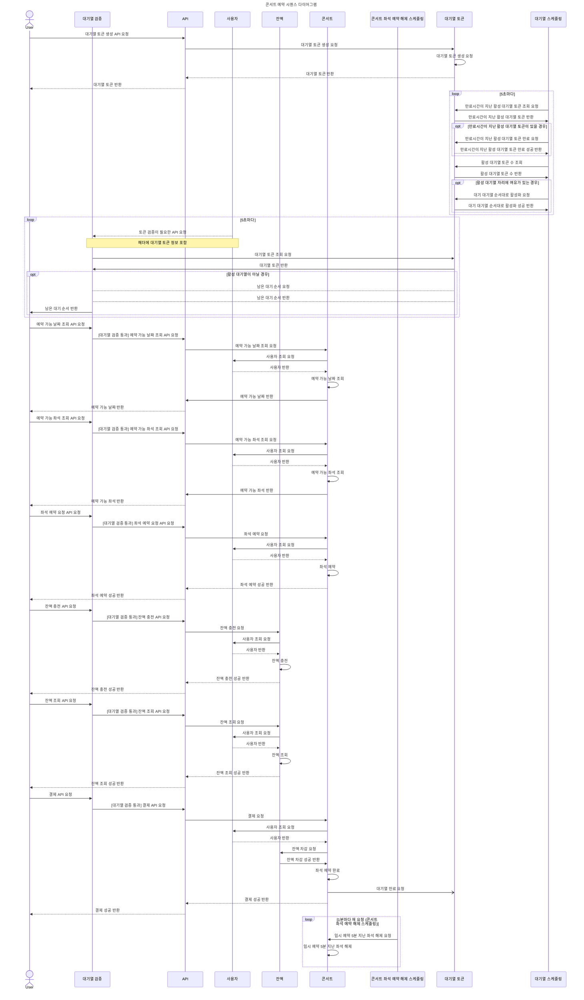
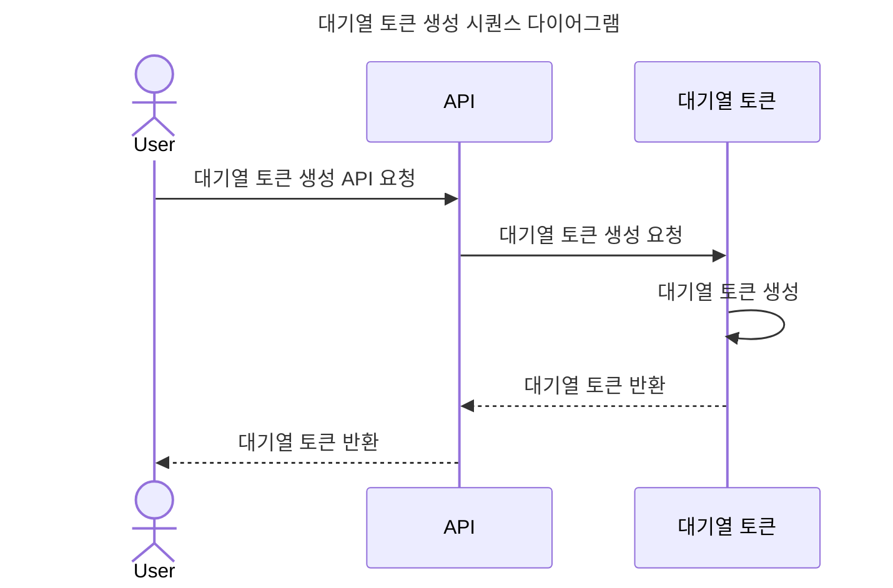
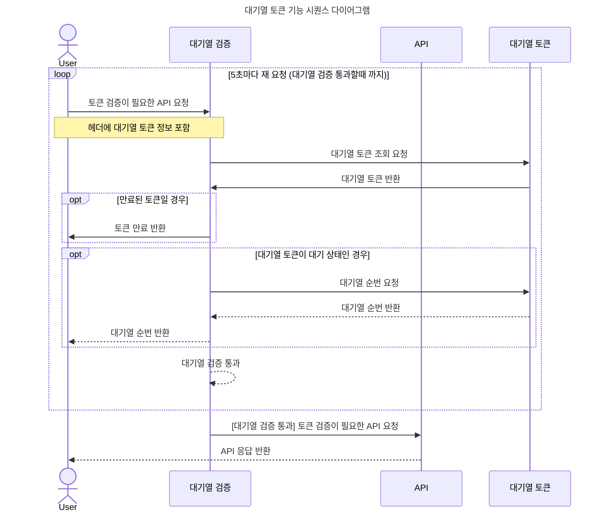
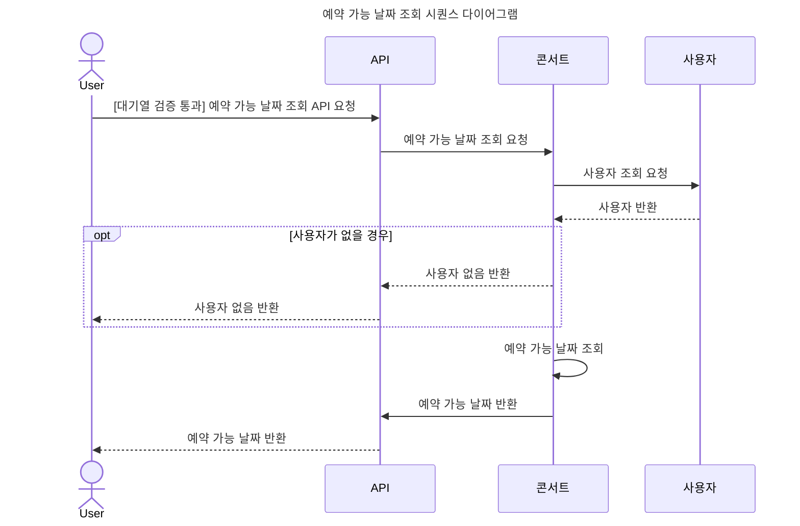
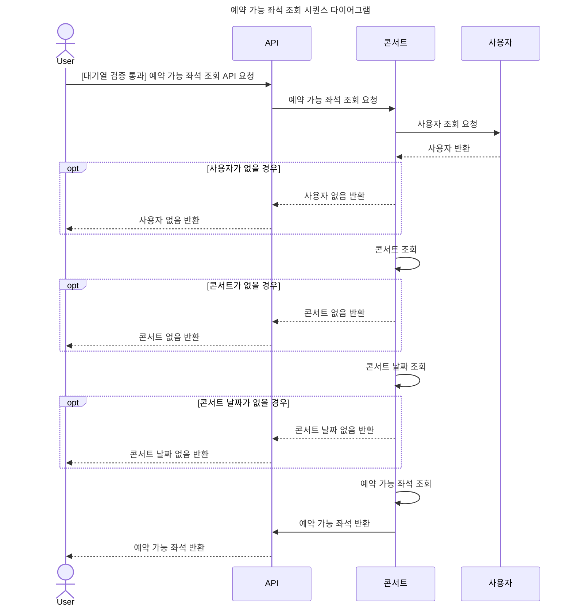
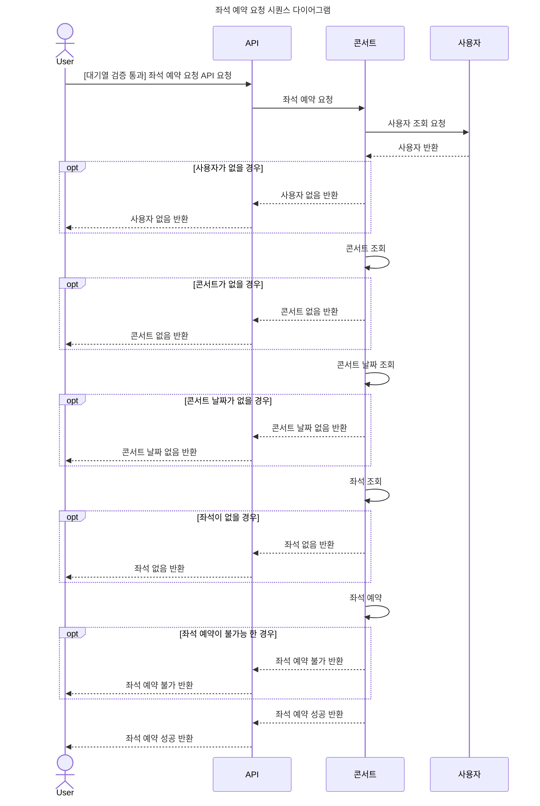
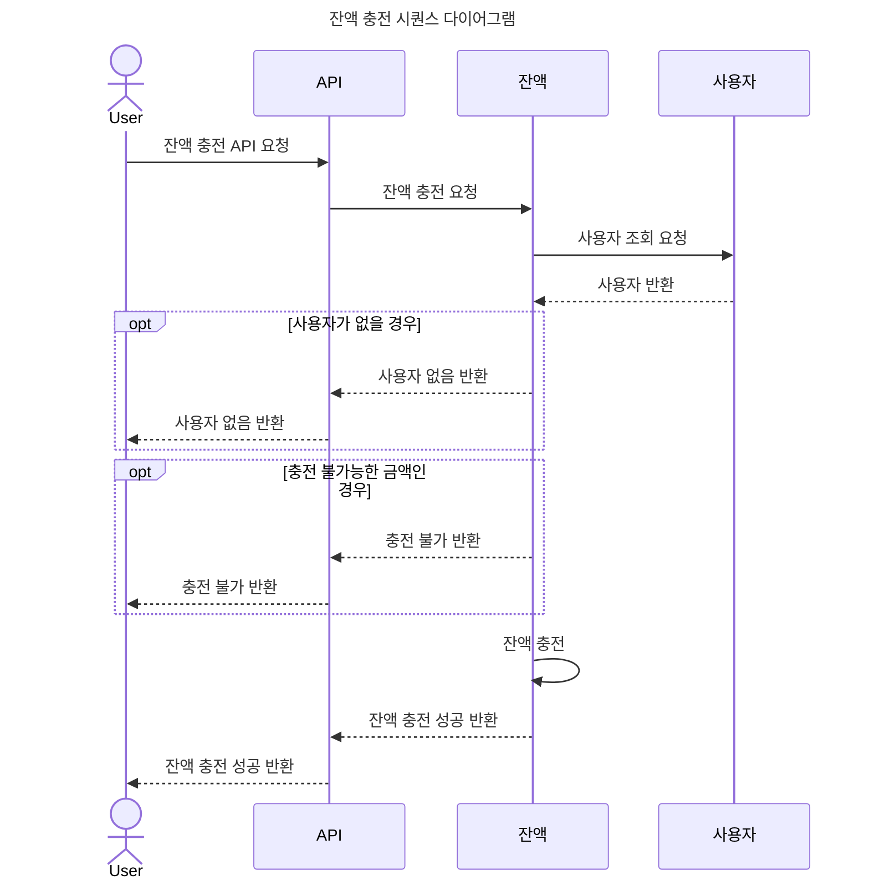
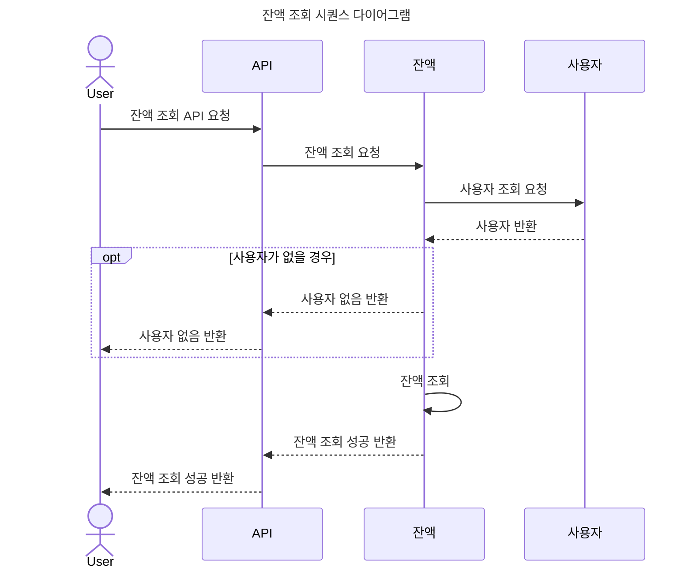
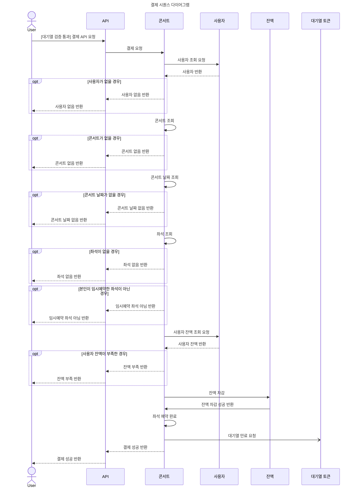

# SEQUENCE DIAGRAM

## 콘서트 예약 시퀀스 다이어그램

전체 콘서트 예약 시퀀스 다이어그램은 자세한 분기처리는 생략하여 성공케이스 위주로 작성하였습니다.  
자세한 분기처리는 각 Use Case별 시퀀스 다이어그램을 참고해주세요.

### 대기열 토큰 생성

### 대기열 토큰 기능

### 예약 가능 날짜 조회

### 예약 가능 좌석 조회

### 좌석 예약 요청 API

여기서 좌석 예약은 결제가 진행되지않은 임시 예약 상태입니다.

### 잔액 충전

### 잔액 조회 API

### 결제 API

